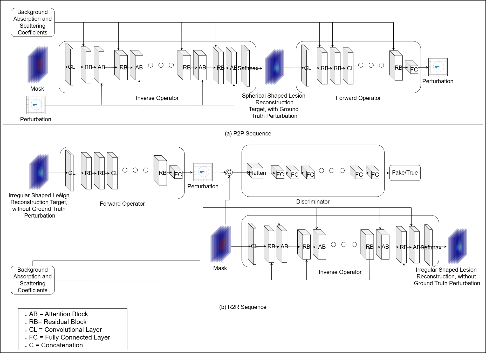

# MCX Breast Phantom Simulation
## Phantom Preparations and Preprocessing 
-> File execution order: (MCX_MATLAB_SIMULATIONS)
1. rotate_compress_2_Lukai.m
2. rotate_compress_3_Lukai.m

## Simulation 
-> Steps:
1. Add matlab_cuda mcx simulation to the path 
2. Execute breast_phantom_DOT_2.m (MCX_MATLAB_SIMULATIONS/simulation_mcx)
3. Use simulation_to_measured_dta_converstion.m to prepare the reference measured data
4. Use changing_all_data_tree.m to change the tree of orientation (MCX_MATLAB_SIMULATIONS)
5. Use make_measured_data_from_tar_fft.m to prepare the target measured data (MCX_MATLAB_SIMULATIONS)

## Perturbation Measurement
-> Steps: (SIMULATION_to_PERTURBATION) 
1. use matlab_to_data_extraction_minghao_data.ipynb for FEM simulation data ground truth and measured data
2. use matlab_to_data_extraction2.ipynb for monteCarlo mcx simulation data ground truth and measured data

# the DOT-AE-GAN approach
## 🏗️ Architecture



## 🚀 Getting Started

### 1. Clone the Repository

```bash
git clone https://github.com/yourusername/DOT-AE-GAN.git
cd DOT-AE-GAN/model_codes
```
1. Run bestmodel_trained_with_fem_onlyref_mua_mus.ipynb for training model.
2. Use codes insides inference for inferencing. 
